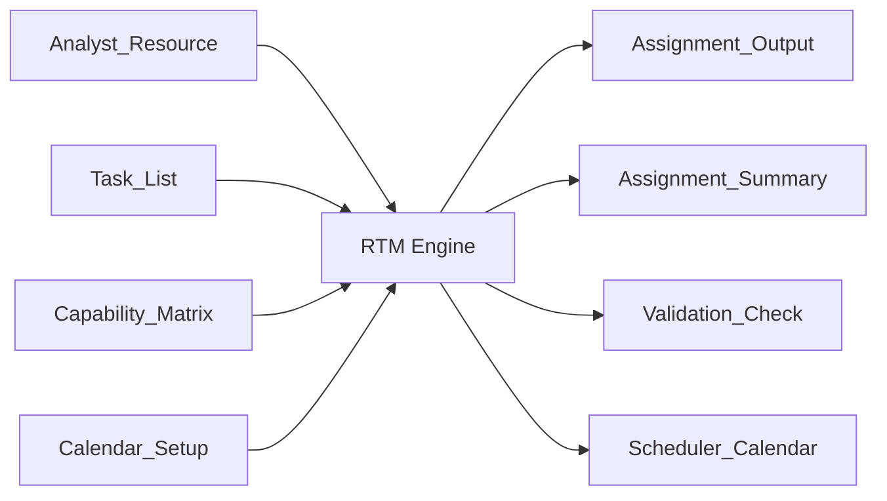

# Resource & Task Manager (RTM)

> A rule-based **workforce allocation engine** (Excel VBA) that automates monthly operational resource planning — matching qualified analysts to tasks under real-world capability, priority, and coverage constraints.

> **Portfolio note:** All task names, capability codes, analyst names, thresholds, and metrics below are **placeholders**. No proprietary logic or real operational data is included.

---

## Executive Summary

RTM replaces a slow, manual, error-prone monthly resource-planning process with a deterministic engine that allocates work the way an experienced operations manager would — fairly, sustainably, and in line with business priorities. It reads an analyst roster, a task catalog, and a capability matrix, then produces a fully auditable allocation plus a calendar-based schedule for daily recurring duties. Given the same inputs, it produces the same result every time.

---

## Business Context

The engine operates in an analyst-operations setting where a population of analysts, each certified for a different mix of specialized capabilities, must cover a monthly catalog of tasks. Work is governed by capability certification, priority tiers, exposure limits, self-approval rights, and daily coverage obligations. Planning is a recurring monthly exercise repeated across a large analyst population.

---

## Business Problem

Manual monthly planning had three chronic failures:

- **Inconsistency** — outcomes depended on who did the planning and in what order.
- **Low auditability** — it was hard to explain *why* a given analyst got a given task, or to prove coverage was met.
- **Hidden daily gaps** — a plan could look "100% allocated" for the month while still breaching daily coverage floors on individual days.

The organization needed allocations that were qualified, balanced, priority-aware, and provably complete — without hours of manual effort.

---

## Solution Overview

RTM models allocation as a constrained optimization problem rather than a naive assignment loop. Each decision weighs capability match, remaining capacity, task priority, exposure reserves, and overall balance simultaneously. It honors planner overrides (manual locks), fills specialist pools first, distributes remaining work fairly, applies self-approval offsets, and emits validation output that surfaces every gap.

---

## Architecture

Four input sheets drive the engine; several output sheets capture results and warnings.



**Input sheets**

| Sheet | Purpose |
|-------|---------|
| `Analyst_Resource` | Roster: available hours, priority group, exposure reserve %, manual locks, exclusions |
| `Task_List` | Catalog: required capability, monthly hours, priority rank, per-analyst caps, approval-offset rules |
| `Analyst_Capability_Matrix` | Certification grid: capabilities and self-approval rights per analyst |
| `Calendar_Setup` | Working-day flags for the recurring schedule |

**Output sheets**

| Sheet | Purpose |
|-------|---------|
| `Assignment_Output` | Row-level record of every allocation |
| `Assignment_Summary` | Aggregated hours per analyst per task |
| `Validation_Check` | Warnings: unassigned hours, mismatches, uncovered days |
| `Scheduler_Calendar` | Day-by-day recurring-duty schedule |

**Capability model (placeholder):** capabilities are generic — **Capability A / B / C**, each with an *analysis* and *approval* variant plus a self-approval flag. The engine reads column positions, not hard-coded names, so any taxonomy drops in.

---

## Key Features

- **Capability-gated assignment** — analysts receive only work they are certified for.
- **Priority-tier allocation** — specialist/priority pools are drained before the general pool.
- **Round-robin balancing** — work spreads across analysts in fixed increments to avoid mono-loading.
- **Exposure reserves** — a configurable % of each analyst's hours is held back and released only when needed.
- **Self-approval offsets** — related approval workload is auto-reduced when an analyst can approve their own work.
- **Manual locks** — planners pin specific analysts to tasks; honored before auto-allocation.
- **Recurring schedule generation** — calendar-based coverage with per-day requirements, per-analyst daily caps, and alternate-day rotation.
- **Validation & audit output** — every gap and mismatch is surfaced, not silently absorbed.

---

## Technology Stack

- **Excel VBA** — implementation environment
- **Excel worksheets** — data model, configuration, and reporting layer
- **Mermaid** — architecture diagram (renders natively on GitHub)

---

## Implementation Highlights

- **Analyst-centric fill:** priority analysts are drained across *all* eligible tasks first, rather than filling tasks one at a time — a deliberate redesign from the original task-centric loop.
- **Order-independent lookups:** tasks are resolved by name, not row position, after in-place sorting was found to silently scramble related-task references.
- **Multi-pass reserve release:** a first pass respects exposure reserves; later passes release them only if work remains, keeping balance without stranding hours.
- **Deterministic randomness:** the *only* randomness is analyst ordering within a tier — bounded, and it never changes *who is eligible*, preserving reproducibility.

---

## Business Impact

> *Metrics below are illustrative placeholders — replace with your measured results.*

- **Planning time:** reduced from *[X hours]* of manual work to a single macro run.
- **Consistency:** identical inputs now yield identical, explainable allocations.
- **Auditability:** every assigned hour is traceable to an output row; every coverage gap is flagged automatically.
- **Coverage integrity:** daily floors are validated independently of monthly totals, catching gaps that aggregate views hide.

---

## Challenges & Lessons Learned

- **Monthly totals hide daily gaps.** The core insight: 100% monthly allocation can coexist with daily coverage breaches. "Hours" obscured that some duties are *daily minimums*, not monthly budgets — this reframed the whole scheduling model.
- **Independent eligibility gates interact.** Stacking capability, specialization, and self-approval gates could combine into zero-eligible-analyst states that were hard to debug without enumerating gates systematically.
- **Sorting is a hidden dependency.** In-place sorting of source data broke position-based references; switching to name-based lookups fixed a whole class of silent failures.
- **Additive beats rewrite.** Preserving prior fixes explicitly across versions kept the engine auditable and prevented regressions.

---

## Future Improvements

- [ ] Formalize non-deferrable daily floors as first-class objects (**Tier 0**).
- [ ] Capacity-netting mode: reserve daily floors upfront, allocate the remainder.
- [ ] Optional full daily-schedule-per-analyst build.
- [ ] Escalation signals when a daily floor slips.

---

## Getting Started

1. Open the workbook and enable macros.
2. Populate the four input sheets (sample placeholder data included).
3. Run the entry-point macro:
   ```vba
   Run_RTM_Assignment
   ```
4. Review `Assignment_Summary`, `Validation_Check`, and `Scheduler_Calendar`.

**Configuration constants** (illustrative placeholders — tune to your operation):

| Constant | Default | Meaning |
|----------|---------|---------|
| `CHUNK_SIZE` | `8` | Hours per task, per analyst, per round-robin cycle |
| Daily cap (per analyst) | `2` | Max recurring-duty hours one analyst takes per day |
| Daily requirement | `32` | Total recurring-duty hours to cover per working day |

---

## License

MIT — see [`LICENSE`](LICENSE).

---

*Built to demonstrate rule-based optimization, constraint modeling, and auditable automation design. Sample data is fictional.*
