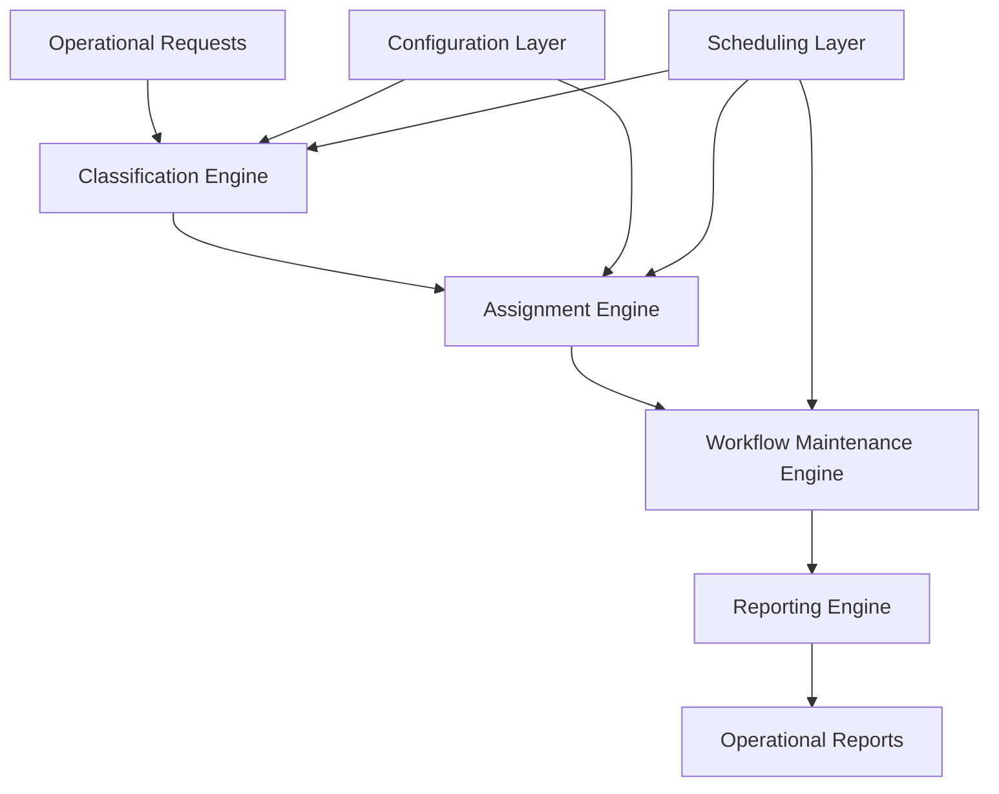

# Jira Automation Engine

> **Status:** Production System *(Sanitized Portfolio Case Study)*  
> **Role:** Solution Architect • Workflow Automation Engineer • Python Developer  
> **Technologies:** Python • Jira Cloud REST API • Confluence • GitLab CI/CD • Excel Reporting

A scalable workflow automation platform designed to overcome the operational limitations of native Jira Automation within a high-volume enterprise environment.

The solution automates workload classification, analyst allocation, approval routing, workflow maintenance, and operational reporting while remaining resilient under workloads that exceeded the capabilities of native automation.

> **Portfolio Note:** This document presents the engineering approach, architectural decisions, and business outcomes of the solution. Proprietary code, workflow configurations, business rules, identifiers, infrastructure details, and organization-specific implementation have been intentionally omitted.

---

# Executive Summary

As operational volume increased, native Jira Automation was no longer capable of supporting the organization's workflow requirements.

Large operational workloads regularly exceeded automation execution limits, creating manual maintenance overhead, inconsistent workload distribution, and increasing operational risk.

To address these challenges, I designed and implemented a modular automation platform that coordinates workflow execution, dynamically manages workload allocation, centralizes operational configuration, and generates auditable reporting.

Rather than replacing people, the solution removes repetitive operational work while allowing teams to retain ownership of business decisions and workflow configuration.

---

# Business Context

The solution supports a high-volume operational workflow where each parent request generates large numbers of related work items requiring coordinated processing.

Operational success depends on maintaining balanced workload distribution, consistent approval routing, reliable workflow maintenance, and transparent reporting.

The automation also supports distributed ownership:

- Operations manage workflow configuration.
- Team Leads maintain assignment pools.
- Infrastructure manages deployment and scheduling.
- The automation platform coordinates execution.

Separating these responsibilities reduced operational dependencies while improving maintainability.

---

# Business Problem

The organization faced several operational challenges as workflow volume increased.

### Platform Scalability

Native automation struggled to process increasingly large operational workloads, resulting in execution limitations during critical workflow activities.

### Manual Operational Maintenance

Daily workflow maintenance required repetitive manual intervention to recycle unfinished work and redistribute assignments.

### Configuration Management

Updating assignment ownership required technical changes rather than operational updates, slowing organizational responsiveness.

### Operational Visibility

Existing automation provided limited reporting, making troubleshooting and operational auditing increasingly difficult.

The organization required an automation platform capable of supporting enterprise-scale workloads while remaining transparent, maintainable, and operationally sustainable.

---

# Solution Overview

The solution adopts a modular architecture where each automation capability is responsible for a specific operational responsibility.

Core capabilities include:

- Operational workload classification
- Intelligent workload allocation
- Automated approval routing
- Daily workflow maintenance
- Operational reporting
- Centralized scheduling
- Shared configuration management

Operational configuration is maintained outside the application itself, allowing business users to manage ownership without software changes.

Independent automation modules are coordinated through a centralized orchestration layer that manages scheduling, execution sequencing, and reporting.

---

# Solution Architecture

---

# Solution Components

| Component | Responsibility |
|-----------|----------------|
| Classification Engine | Determines workload characteristics and routing strategy |
| Assignment Engine | Distributes work across operational teams |
| Workflow Maintenance Engine | Performs scheduled maintenance and workload recycling |
| Configuration Layer | Centralized operational configuration managed by business users |
| Scheduling Layer | Coordinates execution timing across automation modules |
| Reporting Engine | Produces operational reports and execution summaries |

---

# Key Features

- Modular workflow automation
- Intelligent workload allocation
- Centralized configuration management
- Operational self-service
- Scheduled workflow maintenance
- Automated reporting
- Persistent workload balancing
- Fail-fast operational validation
- Scalable processing architecture

---

# Technology Stack

| Technology | Purpose |
|------------|---------|
| Python | Automation platform |
| Jira Cloud REST API | Workflow integration |
| Confluence | Operational configuration |
| GitLab CI/CD | Scheduled execution |
| Excel | Operational reporting |
| Mermaid | Architecture documentation |

---

# Engineering Decisions

Several architectural decisions significantly improved the reliability and long-term maintainability of the platform.

### Modular Automation

Rather than building one large automation process, the solution separates responsibilities into independent modules coordinated through a centralized orchestration layer.

This simplifies maintenance while allowing individual workflows to evolve independently.

---

### Configuration Outside the Application

Operational ownership was intentionally separated from software implementation.

Configuration is maintained by business users, reducing deployment overhead and allowing operational changes without developer involvement.

---

### Fail-Fast Philosophy

The platform intentionally surfaces configuration or workflow issues immediately rather than attempting silent recovery.

This approach improves operational trust by making failures visible, actionable, and easier to diagnose.

---

### Operational Observability

Reporting was treated as a core feature rather than an afterthought.

Every execution produces operational outputs that support validation, troubleshooting, and continuous improvement.

---

### Resilient Workload Distribution

Work allocation is designed to remain balanced across repeated scheduled executions while preventing unfair distribution caused by transient failures.

---

# Business Impact

> **Representative outcomes shown below. Replace with measured production metrics where appropriate.**

## Operational Benefits

- Reduced repetitive operational workload
- Improved workload consistency across analysts
- Enabled self-service operational administration
- Simplified workflow maintenance
- Increased operational transparency

## Technical Benefits

- Scalable automation architecture
- Modular workflow design
- Centralized configuration management
- Automated operational reporting
- Improved system maintainability
- Greater platform resilience

---

# Challenges & Lessons Learned

Designing enterprise workflow automation extends far beyond writing automation scripts.

Several lessons significantly influenced the final architecture.

### Platform Constraints Shape Architecture

Understanding platform limitations early prevents long-term scalability issues.

Design decisions should anticipate operational growth rather than today's workload.

---

### Configuration Is a Product

Operational configuration deserves the same design attention as application code.

Empowering business users to manage configuration reduced technical dependencies and improved agility.

---

### Observability Is Essential

Automation should explain its own behavior.

Meaningful reporting, validation, and diagnostics are critical for building operational confidence.

---

### Reliability Comes Before Automation

Automating unreliable processes simply scales existing problems.

Operational validation, predictable behavior, and clear failure modes are more valuable than maximizing automation.

---

# Future Improvements

- Expand operational monitoring capabilities
- Improve execution analytics
- Introduce predictive workload balancing
- Extend reporting capabilities
- Evaluate AI-assisted operational recommendations

---

# My Role

I designed and developed the Jira Automation Platform from concept through production deployment.

Responsibilities included:

- Business process analysis
- Solution architecture
- Workflow design
- Python automation development
- API integration
- Configuration strategy
- Operational reporting
- Testing and validation
- Documentation
- Continuous enhancement

---

# Repository Purpose

This repository is part of my professional engineering portfolio.

The documentation focuses on business problems, architectural decisions, automation strategy, and engineering practices rather than implementation details.

Confidential business logic, production source code, infrastructure configuration, organizational data, and proprietary implementation have been intentionally omitted.

---

> *This project demonstrates how enterprise workflow automation can be designed to remain scalable, maintainable, and operationally sustainable while balancing business ownership with engineering reliability.*
