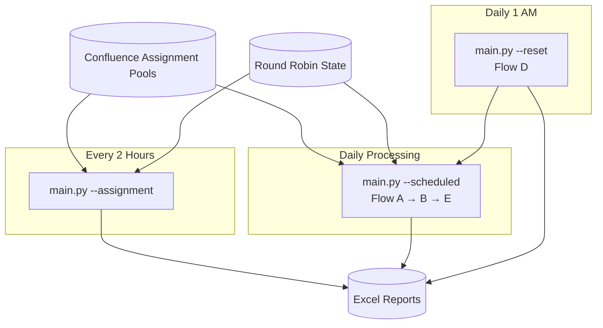

# Jira Automation Engine

> **Status:** Production Prototype *(Sanitized Portfolio Version)*  
> **Role:** Solution Architect • Python Developer • Workflow Automation Engineer  
> **Technologies:** Python • Jira Cloud REST API • Confluence Cloud REST API • GitLab CI/CD • Excel Reporting • Mermaid

A Python-based automation platform designed to overcome the scalability limitations of native Jira Automation on a high-volume Jira Cloud project.

The solution automates parent-ticket classification, workload distribution, approval routing, and daily reset/recycle operations across parent tickets containing **thousands of subtasks**—well beyond the execution limits of native Jira Automation.

> **Portfolio Note:** Repository paths, field IDs, Confluence page IDs, workflow names, issue types, thresholds, and organizational details have been generalized. This case study demonstrates the engineering approach while protecting confidential operational information.

---

# Executive Summary

Native Jira Automation limits branch execution to approximately **1,000 issues per branch**, making it unsuitable for operational workflows where a single parent ticket can contain several thousand subtasks.

To overcome this limitation, I designed and implemented a Python-based automation engine that replaces native automation with paginated Jira REST API calls, centralized orchestration, live Confluence-managed assignment pools, and scheduled workflow execution.

Rather than silently skipping work when limitations are reached, the engine is intentionally designed to **fail loudly**, ensuring operational issues are immediately visible while generating timestamped Excel reports for every execution.

---

# Business Context

The automation operates within a high-volume Jira Cloud environment supporting operational teams responsible for processing thousands of workflow subtasks.

Each parent ticket represents a large operational workload containing multiple categories of subtasks requiring different assignment rules, approval paths, and daily maintenance routines.

The workflow must continuously:

- classify parent tickets
- assign analysts and approvers
- recycle unfinished work
- distribute workloads fairly
- support frequent team membership changes
- remain fully auditable

Operational ownership is intentionally separated:

- Team Leads manage assignment pools directly in Confluence.
- Infrastructure manages scheduling and deployment.
- The automation engine coordinates workflow execution.

---

# Business Problem

Native Jira Automation could no longer support the operational workload.

The primary limitations included:

- **Volume Constraints** — native automation stops processing after approximately 1,000 issues within a branch, while individual parent tickets regularly exceeded that volume.
- **Manual Maintenance** — assignment pools required automation updates whenever team membership changed.
- **Incomplete Daily Reset** — unfinished subtasks required daily recycling across every active parent ticket, exceeding native automation capabilities.
- **Limited Scalability** — growing operational volume required increasingly complex automation rules that became difficult to maintain.

The organization required a scalable, maintainable, and fully auditable automation platform capable of processing operational workloads without execution limits.

---

# Solution Overview

The solution consists of several independent Python automation flows coordinated by a central orchestration layer.

Each flow performs one clearly defined responsibility:

- Parent classification
- Analyst assignment
- Approver assignment
- Customer review reassignment
- Daily reset and recycle
- Reporting

Assignment pools are retrieved dynamically from Confluence, allowing operational leads to update team membership without modifying code or deployment pipelines.

The orchestration engine schedules every workflow independently while maintaining shared round-robin allocation state and centralized reporting.

---

# Solution Architecture



## Core Components

| Component | Responsibility |
|-----------|----------------|
| `0-confluence_pools.py` | Retrieves live assignment pools from Confluence |
| `1-parent_assignment.py` | Parent classification and POC assignment |
| `2-autocreation_assignment.py` | Auto-creation approval assignment |
| `3-manual_review_assignment.py` | Manual review assignment |
| `4-reassign_customer_review.py` | Customer review reassignment |
| `5-reset_recycle.py` | Daily reset and recycle routines |
| `main.py` | Central workflow orchestrator |
| `reporter.py` | Excel report generation |

---

# Key Features

- Unlimited Jira pagination using `nextPageToken`
- Live Confluence-managed assignment pools
- Persistent round-robin workload balancing
- Automatic workload quota calculation
- Daily workflow reset and recycle
- Timestamped Excel audit reports
- Read-only dry-run mode
- Fail-loud error handling
- Independent workflow scheduling

---

# Technology Stack

| Technology | Purpose |
|------------|---------|
| Python | Automation engine |
| Jira Cloud REST API v3 | Workflow automation |
| Confluence Cloud REST API v2 | Assignment pool management |
| GitLab CI/CD | Scheduled execution |
| Excel Reporting | Operational audit reports |
| Mermaid | Architecture documentation |

---

# Engineering Decisions

Several architectural decisions significantly improved reliability and maintainability.

### Live Configuration Instead of Hardcoded Logic

Assignment pools are stored in Confluence rather than source code, allowing Team Leads to manage operational ownership without requiring deployments.

---

### Dynamic Workflow Loading

The orchestrator dynamically imports each automation flow at runtime, allowing every workflow to remain independent while sharing a common execution framework.

---

### Delegated Workflow Ownership

Each automation flow is responsible for retrieving its own data, processing tickets, and generating reports.

The orchestrator coordinates execution without duplicating business logic.

---

### Persistent Round-Robin Allocation

Assignment state advances only after successful ticket updates.

Failed assignments automatically retry the same analyst on the next execution instead of silently skipping workload.

---

### Fail-Loud Design

Rather than attempting silent recovery, missing pools, classifications, or configuration errors immediately stop execution and surface actionable errors.

Operational issues should be visible—not hidden.

---

# Business Impact

> **Metrics below are representative placeholders.**

## Operational Benefits

- Eliminated native Jira Automation volume limitations
- Reduced manual assignment maintenance
- Enabled self-service team management through Confluence
- Improved workload consistency across analysts
- Simplified operational support

## Technical Benefits

- Unlimited API pagination
- Centralized orchestration
- Resilient round-robin allocation
- Timestamped audit reporting
- Configurable workflow scheduling
- Modular automation architecture

---

# Challenges & Lessons Learned

Developing the automation uncovered several platform-specific behaviors that significantly influenced the final architecture.

### Jira Authentication Can Return 404

Expired API credentials may return **404 Not Found** rather than **401 Unauthorized**, making authentication failures appear as missing tickets.

---

### JQL Behaves Differently Than Expected

Multi-value `status IN (...)` clauses unexpectedly returned zero results within this Jira environment.

Using explicit OR conditions produced reliable behavior.

---

### Jira Search APIs Continue to Evolve

Migration from deprecated `/search` endpoints to `/search/jql` required redesigning pagination logic using `nextPageToken` rather than `startAt`.

---

### Configuration Belongs Outside Code

Moving assignment pools into Confluence significantly reduced maintenance effort while allowing operational ownership to remain with Team Leads.

---

### Fail Fast Beats Silent Recovery

Surfacing configuration problems immediately proved significantly more reliable than attempting automatic fallback behavior.

---

# Future Improvements

- Resolve remaining JQL edge cases
- Improve report delivery mechanisms
- Validate scheduler timing under higher operational volume
- Evaluate daily execution for all assignment flows
- Expand diagnostic tooling

---

# My Role

I designed and developed the Jira Automation Engine from concept through implementation.

My responsibilities included:

- Operational workflow analysis
- Solution architecture
- Python development
- Jira REST API integration
- Confluence integration
- Workflow orchestration
- GitLab CI/CD integration
- Testing and debugging
- Documentation
- Production support

---

# Getting Started

```bash
python main.py --reset
python main.py --assignment
python main.py --scheduled
```

For validation before execution:

```bash
python flowd_dry.py
python flowd_dry.py --debug
```

---

# Environment

| Variable | Required | Description |
|-----------|----------|-------------|
| `JIRA_URL` | Yes | Jira Cloud instance |
| `JIRA_USERNAME` | Yes | Atlassian account |
| `JIRA_API_TOKEN` | Yes | API token |
| `RR_STATE_FILE` | Optional | Round-robin state |
| `REPORT_DIR` | Optional | Excel report output |

---

# License

MIT License

---

> *This project demonstrates how enterprise workflow automation can overcome platform limitations through scalable architecture, resilient scheduling, and operationally focused engineering.*
