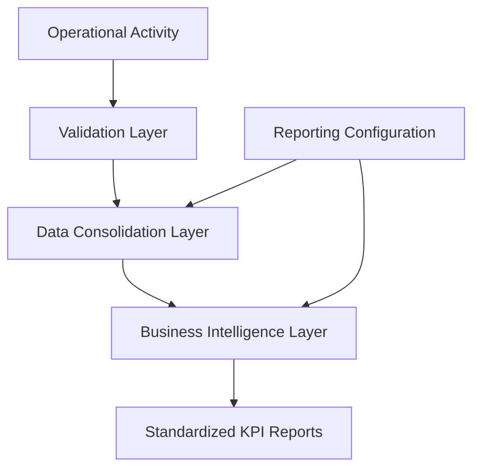

# Operational KPI Reporting Platform

> **Status:** Production System *(Sanitized Portfolio Case Study)*  
> **Role:** Solution Architect • Business Intelligence Designer • Excel Automation Developer  
> **Technologies:** Microsoft Excel • VBA • Power Query • Business Intelligence • OneDrive • SharePoint

A semi-automated reporting platform that transforms distributed operational activity into standardized, refreshable KPI reporting through workflow automation, data consolidation, and business intelligence.

The platform replaces repetitive monthly report preparation with a structured reporting pipeline that captures operational activity, validates quality information, consolidates distributed datasets, and produces standardized KPI reports with minimal manual effort.

> **Portfolio Note:** This case study focuses on the business problem, solution architecture, engineering decisions, and operational outcomes. Proprietary workbook structures, business formulas, reporting definitions, datasets, and organization-specific implementation details have been intentionally generalized or omitted.

---

# Executive Summary

Monthly KPI reporting previously required significant manual effort from operational leads to consolidate analyst activity, reconcile quality information, validate results, and prepare standardized reports.

To improve consistency and reduce recurring administrative effort, I designed an Excel-native reporting platform that automates data consolidation, standardizes KPI calculations, and simplifies monthly reporting into a repeatable refresh-and-validation workflow.

Rather than manually assembling reports, operational leads focus on validating results and interpreting performance data.

The result is a scalable reporting process that improves consistency, transparency, and operational efficiency.

---

# Business Context

The platform supports an operational environment where analyst performance is measured through multiple productivity, quality, and utilization indicators.

Performance information originates from distributed operational activities performed throughout the month and must be consolidated into a standardized reporting framework.

The reporting process requires:

- Consistent KPI calculations
- Reliable quality tracking
- Standardized reporting outputs
- Centralized reporting governance
- Minimal recurring administrative effort

As operational teams grew, maintaining reporting quality while reducing manual effort became increasingly important.

---

# Business Problem

The previous reporting process introduced several operational challenges.

### High Administrative Overhead

Operational leads spent several hours every month collecting, validating, and consolidating reporting data.

### Fragmented Information

Operational activity and quality information existed across multiple sources, requiring manual reconciliation before reporting could begin.

### Reporting Inconsistency

Manual report preparation increased the likelihood of inconsistent calculations and reporting discrepancies.

### Limited Scalability

As the number of analysts increased, the reporting process became progressively more difficult to maintain without additional administrative effort.

The organization required a reporting solution capable of producing consistent, auditable, and scalable KPI reports while minimizing manual intervention.

---

# Solution Overview

The reporting platform follows a layered architecture that separates operational data capture, validation, consolidation, and reporting.

Rather than relying on a single workbook or manual reporting process, each layer performs a dedicated responsibility while contributing to a centralized reporting workflow.

Core capabilities include:

- Operational activity capture
- Quality information integration
- Automated data consolidation
- Standardized KPI calculations
- Refreshable reporting
- Centralized reporting outputs

The platform intentionally minimizes daily administrative effort while enabling repeatable monthly reporting.

---

# Solution Architecture

---

# Solution Components

| Component | Responsibility |
|-----------|----------------|
| Activity Capture Layer | Collects operational activity throughout the reporting period |
| Validation Layer | Consolidates and validates operational quality information |
| Reporting Configuration | Maintains KPI definitions and reporting configuration |
| Data Consolidation Layer | Combines distributed operational data into a unified reporting dataset |
| Business Intelligence Layer | Calculates standardized KPIs and prepares reporting outputs |
| Reporting Layer | Produces refreshable operational reports |

---

# Key Features

- Automated reporting workflow
- Centralized KPI calculations
- Refreshable reporting architecture
- Distributed data consolidation
- Standardized reporting outputs
- Built-in validation support
- Scalable reporting process
- Operational transparency

---

# Technology Stack

| Technology | Purpose |
|------------|---------|
| Microsoft Excel | Reporting platform |
| VBA | Reporting automation |
| Power Query | Data consolidation and transformation |
| PivotTables | Business intelligence reporting |
| OneDrive / SharePoint | Shared operational storage |

---

# Engineering Decisions

Several architectural decisions significantly improved maintainability, scalability, and long-term adoption.

### Layered Reporting Architecture

The reporting process was intentionally divided into independent layers responsible for data capture, validation, consolidation, and reporting.

Separating responsibilities simplified maintenance while reducing coupling between reporting activities.

---

### Refresh-Based Reporting

Rather than rebuilding reports each month, the platform refreshes an existing reporting model using updated operational data.

This dramatically reduces recurring reporting effort while maintaining reporting consistency.

---

### Centralized Data Consolidation

Distributed operational information is consolidated through a centralized processing layer, allowing reporting to scale as team size and reporting volume increase.

---

### Stable Data Modeling

Structured data relationships replace manually maintained worksheet references wherever possible.

This improves long-term maintainability as reporting requirements evolve.

---

### Adoption-First Design

The reporting workflow was intentionally designed to minimize daily user effort.

Keeping operational data entry lightweight significantly improved adoption while increasing reporting accuracy.

---

# Business Impact

> **Representative outcomes shown below. Replace with measured production metrics where appropriate.**

## Operational Benefits

- Reduced recurring monthly reporting effort
- Standardized KPI reporting across operational teams
- Improved reporting consistency
- Simplified operational reporting processes
- Increased transparency and auditability

## Technical Benefits

- Automated reporting pipeline
- Refreshable reporting architecture
- Centralized KPI calculations
- Scalable data consolidation
- Improved reporting maintainability
- Reduced manual reconciliation

---

# Challenges & Lessons Learned

Developing reporting automation involves more than automating spreadsheets.

Several lessons significantly influenced the final solution.

### Reporting Quality Depends on Data Quality

Reliable reporting begins with reliable operational data.

Validation became an essential part of the reporting workflow rather than a final review step.

---

### Automation Supports — Not Replaces — Governance

Automation reduced repetitive work but did not eliminate the need for operational validation.

Human oversight remains essential for maintaining reporting quality.

---

### Design for Growth

Reporting solutions should anticipate organizational growth.

Designing for scalability early reduced future maintenance while simplifying onboarding as the team expanded.

---

### User Experience Determines Adoption

Even highly capable reporting platforms provide limited value if they increase operational workload.

Prioritizing simplicity and usability significantly improved long-term adoption.

---

# Future Improvements

- Scheduled report refresh
- Automated validation rules
- Duplicate detection
- Interactive Power BI reporting
- Automated report distribution
- Trend and forecasting capabilities

---

# My Role

I designed and developed the Operational KPI Reporting Platform from concept through operational deployment.

My responsibilities included:

- Business requirements analysis
- KPI framework design
- Solution architecture
- Excel automation development
- Reporting model design
- Data consolidation strategy
- Validation framework
- Testing and quality assurance
- Documentation
- User rollout and continuous enhancement

---

# Repository Purpose

This repository is part of my professional engineering portfolio.

The documentation focuses on business challenges, reporting architecture, engineering decisions, and operational improvements rather than implementation details.

Proprietary workbook structures, business formulas, operational datasets, and organization-specific reporting logic have been intentionally omitted.

---

> *This project demonstrates how thoughtful reporting architecture, business intelligence, and workflow automation can transform repetitive operational reporting into a scalable, auditable, and sustainable decision-support platform.*
