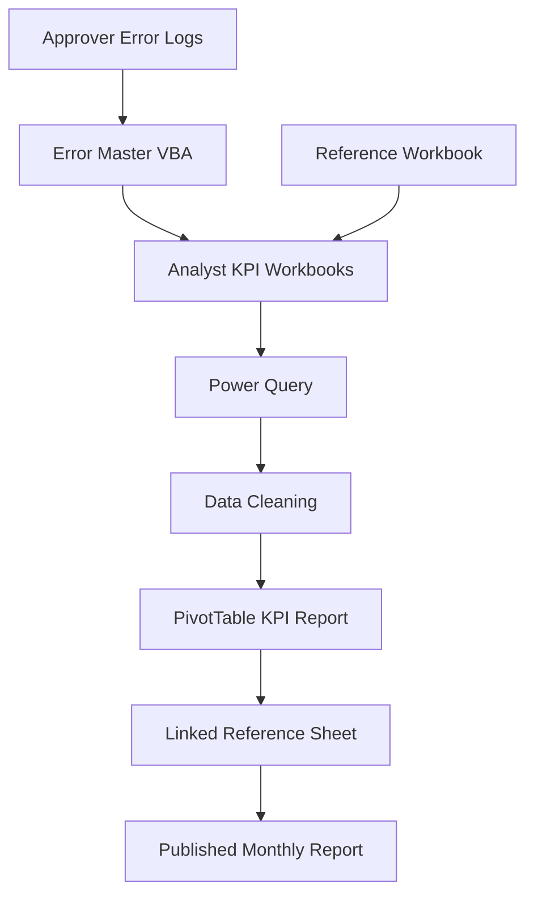

# KPI Reporting Automation Platform

> **Status:** Production System *(Sanitized Portfolio Version)*  
> **Role:** Solution Architect • Excel Automation Developer • Business Intelligence Designer  
> **Technologies:** Microsoft Excel • VBA • Power Query • PivotTables • OneDrive • SharePoint

A semi-automated KPI reporting platform that transforms lightweight daily analyst activity into consolidated monthly operational reporting.

The solution replaces manual KPI consolidation with an Excel-native automation pipeline that integrates daily task logging, automated error synchronization, Power Query ETL, and refreshable reporting—reducing recurring monthly reporting effort from hours to minutes.

> **Portfolio Note:** Company names, storage locations, workbook names, worksheets, KPI formulas, and operational identifiers have been generalized to protect confidential information while preserving the engineering approach.

---

# Executive Summary

Monthly KPI reporting for analyst teams was previously a manual and time-consuming process owned by team leads.

This solution redesigns the reporting workflow into a layered automation pipeline where analysts capture operational activity daily, VBA automates error integration, Power Query consolidates distributed workbooks, and PivotTables generate standardized KPI reports.

Rather than manually assembling reports every month, team leads simply validate and refresh the reporting pipeline.

The result is a repeatable, auditable, and scalable KPI reporting system requiring only minimal manual effort.

---

# Business Context

The solution supports an operational analyst team where individual performance is measured using throughput, quality, productivity, and time allocation metrics.

Each analyst maintains an individual KPI workbook while approvers record operational quality issues independently.

Every month, team leads are responsible for consolidating all analyst activity into a single performance report using standardized KPI definitions maintained within a central reference workbook.

The reporting process depends on multiple distributed files stored within shared cloud storage and requires consistent KPI calculations across the entire team.

---

# Business Problem

The previous reporting process presented several recurring operational challenges.

- **High Manual Effort** — Team leads spent several hours every month consolidating dozens of analyst workbooks.
- **Fragmented Error Tracking** — Operational quality errors existed separately from KPI reporting, requiring manual reconciliation.
- **Inconsistent Reporting** — Manually assembled reports introduced inconsistencies and increased the likelihood of reporting errors.
- **Limited Scalability** — As the team expanded, monthly consolidation became increasingly difficult to maintain.

The organization required a standardized reporting process capable of producing consistent KPI reports with minimal manual effort while remaining easy to validate and audit.

---

# Solution Overview

The KPI Automation System follows a three-layer architecture that distributes work efficiently across the reporting process.

### 1. Capture Layer

Analysts record completed operational activities within standardized KPI workbooks, requiring only a few minutes of daily effort.

### 2. Enrichment Layer

A VBA-powered Error Master workbook consolidates quality logs from multiple approvers and automatically distributes validated errors into the appropriate analyst KPI files.

### 3. Reporting Layer

Power Query combines every analyst workbook directly from a shared folder, performs data preparation, and loads a consolidated dataset used by PivotTables to generate standardized monthly KPI reports.

---

# Solution Architecture

## Core Components

| Component | Responsibility |
|-----------|----------------|
| Analyst KPI Workbook | Daily operational task logging |
| Error Master Workbook | Automated error consolidation using VBA |
| Reference Workbook | KPI definitions and operational configuration |
| Power Query | Consolidation and ETL |
| PivotTables | KPI reporting |
| Linked Reference Sheet | Publishing-ready reporting output |

---

# Key Features

- Folder-based Power Query consolidation
- Refreshable monthly reporting
- Automated VBA error integration
- Calculated KPI metrics
- Self-updating reference sheets
- Standardized reporting templates
- Built-in data validation
- Shared cloud-based reporting workflow

---

# Technology Stack

| Technology | Purpose |
|------------|---------|
| Microsoft Excel | Reporting platform |
| VBA | Automation and data synchronization |
| Power Query | Data extraction, transformation, and consolidation |
| PivotTables | KPI reporting |
| OneDrive / SharePoint | Shared data storage |

---

# Engineering Decisions

Several architectural decisions significantly improved reliability, maintainability, and long-term usability.

### Refresh Instead of Rebuild

Rather than manually recreating reports every month, the reporting pipeline refreshes an existing Power Query model.

This dramatically reduces recurring operational effort.

---

### Folder-Based Consolidation

Power Query combines analyst workbooks directly from a shared folder.

Adding or removing analysts requires no reporting redesign.

---

### Automated Error Synchronization

Instead of manually copying quality errors into KPI files, a VBA automation distributes validated error records directly into each analyst workbook.

---

### Table-Based References

The reporting layer links data using Excel Table names instead of worksheet ranges.

This prevents broken formulas when datasets grow or worksheet structures change.

---

### Adoption-First Design

Daily analyst logging intentionally requires only a few minutes.

Reducing user effort significantly improved long-term adoption and reporting consistency.

---

# Business Impact

> **Figures below represent illustrative outcomes and should be replaced with measured operational metrics.**

## Operational Benefits

- Reduced monthly KPI consolidation effort from several hours to a simple refresh process
- Standardized reporting across the entire analyst team
- Reduced manual reconciliation work
- Improved reporting consistency and auditability
- Simplified monthly reporting operations

## Technical Benefits

- Automated Excel-native ETL pipeline
- Folder-based data ingestion
- Refreshable reporting architecture
- Centralized KPI calculations
- Automated error synchronization
- Standardized reporting templates

---

# Challenges & Lessons Learned

Several practical engineering lessons shaped the final solution.

### Data Quality Determines Report Quality

Power Query can only consolidate reliable source data.

Validation before refresh became a mandatory operational step.

---

### Automation Still Requires Validation

Although VBA automated error synchronization, manual validation remained necessary to detect duplicate or inconsistent records.

Automation improves efficiency but should not eliminate quality assurance.

---

### Table References Scale Better

Range-based Excel references became increasingly fragile as datasets expanded.

Migrating to table-name references significantly improved maintainability.

---

### User Adoption Matters

A technically perfect reporting system provides little value if users avoid it.

Keeping daily analyst effort intentionally lightweight proved critical for long-term adoption.

---

# Future Improvements

- Scheduled report refresh
- Automated duplicate detection
- KPI validation rules
- Power BI reporting layer
- Automated report distribution

---

# My Role

I designed and developed the KPI Automation System from concept through operational deployment.

My responsibilities included:

- Requirements gathering
- KPI framework design
- Excel solution architecture
- VBA automation development
- Power Query ETL design
- Reporting model development
- Data validation framework
- Testing and debugging
- Documentation
- User rollout and continuous enhancement

---

# Operational Workflow

1. Analysts record operational activities within their KPI workbook.
2. The Error Master workbook consolidates quality logs and distributes validated errors.
3. Individual KPI workbooks are refreshed.
4. Power Query consolidates every analyst workbook.
5. Data validation and cleaning are performed.
6. PivotTables generate the monthly KPI report.
7. The linked reporting sheet is published to shared storage.

After initial setup, the monthly reporting process becomes a simple **Refresh → Validate → Publish** workflow.

---

# License

MIT License

---

> *This project demonstrates how thoughtful process design, Excel automation, and lightweight ETL architecture can transform a repetitive manual reporting process into a scalable, auditable, and operationally sustainable KPI reporting system.*
