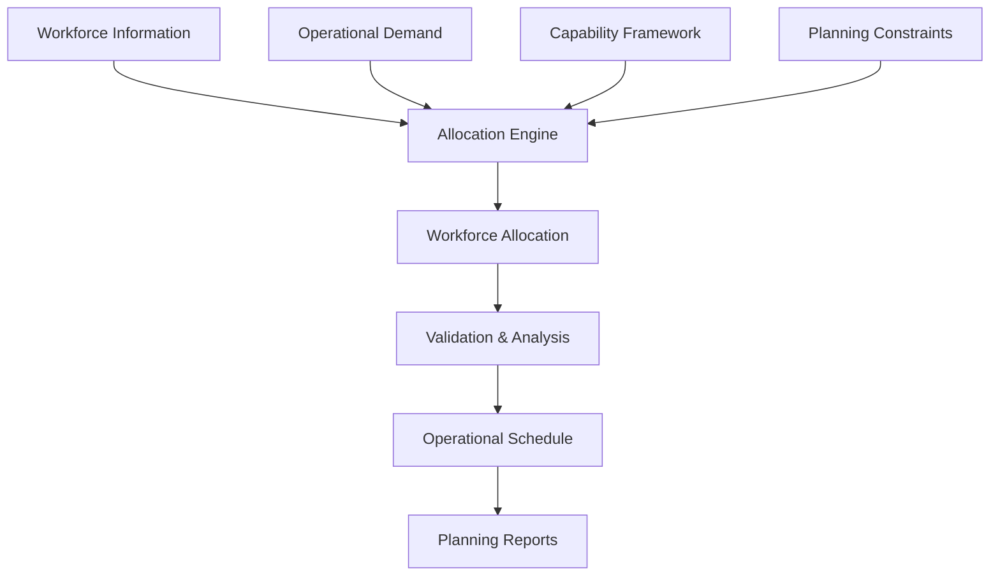

# Workforce Planning & Allocation Engine (RTM)

> **Status:** Production Prototype *(Sanitized Portfolio Case Study)*  
> **Role:** Solution Architect • Process Designer • Excel VBA Developer  
> **Technologies:** Microsoft Excel • Excel VBA • Rule-Based Optimization • Decision Automation

A rule-based workforce planning platform that automates monthly operational resource allocation by matching qualified analysts to work based on capability, business priority, available capacity, and operational constraints.

The platform replaces a manual planning process with a deterministic decision engine capable of generating consistent, auditable, and balanced workforce plans while supporting recurring operational scheduling.

> **Portfolio Note:** This case study focuses on the business challenge, solution architecture, engineering decisions, and operational outcomes. Analyst names, task definitions, business rules, operational thresholds, datasets, and implementation details have been intentionally generalized to protect confidential information.

---

# Executive Summary

Monthly workforce planning previously relied on manual decision making, requiring planners to balance analyst capability, workload capacity, business priorities, and scheduling constraints across a large operational team.

To improve consistency, transparency, and scalability, I designed a rule-based allocation platform that evaluates multiple planning constraints simultaneously and produces deterministic workforce assignments.

Rather than relying on individual judgement, the platform generates repeatable planning outcomes that are easier to validate, explain, and maintain as operational complexity grows.

The result is a workforce planning process that is more balanced, auditable, and operationally sustainable.

---

# Business Context

The platform supports an analyst-driven operational environment where recurring work must be distributed across specialists possessing different certifications, capabilities, approval permissions, and workload availability.

Each monthly planning cycle must balance numerous operational objectives simultaneously, including:

- Workforce capability
- Business priority
- Available capacity
- Operational coverage
- Approval eligibility
- Workload fairness
- Planning constraints

As operational demand increased, maintaining consistency and transparency through manual planning became increasingly difficult.

---

# Business Problem

The existing planning process introduced several recurring operational challenges.

### Inconsistent Planning Decisions

Allocation quality depended heavily on the planner's individual judgement, resulting in inconsistent outcomes between planning cycles.

### Limited Transparency

Understanding why a specific analyst received a particular workload required significant manual investigation.

### Hidden Operational Risk

Monthly capacity appeared balanced while daily operational coverage requirements could still remain unmet.

### High Administrative Effort

Planners spent considerable time balancing workloads while validating numerous operational constraints.

The organization required a planning solution capable of producing consistent, explainable, and scalable workforce allocations while reducing recurring administrative effort.

---

# Solution Overview

The Workforce Planning & Allocation Engine approaches workforce planning as a **constraint-based optimization problem** rather than a sequential assignment exercise.

Each allocation decision considers multiple operational factors simultaneously, including workforce capability, capacity, business priorities, scheduling requirements, workload balancing, and organizational constraints.

Rather than optimizing only for utilization, the platform balances operational fairness, business priorities, and long-term sustainability while producing fully auditable planning results.

---

# Solution Architecture

---

# Solution Components

| Component | Responsibility |
|-----------|----------------|
| Workforce Registry | Maintains workforce availability, capacity, and planning constraints |
| Operational Demand | Defines work requiring allocation |
| Capability Framework | Defines workforce qualifications and eligibility |
| Allocation Engine | Applies optimization rules to generate workforce assignments |
| Validation Layer | Verifies planning completeness and operational constraints |
| Scheduling Layer | Produces recurring operational schedules |
| Reporting Layer | Generates allocation summaries and planning outputs |

---

# Key Features

- Constraint-based workforce allocation
- Capability-aware planning
- Priority-driven workload distribution
- Balanced resource utilization
- Operational scheduling
- Automated validation
- Deterministic planning outcomes
- Transparent allocation logic
- Auditable planning outputs

---

# Technology Stack

| Technology | Purpose |
|------------|---------|
| Microsoft Excel | Planning platform |
| Excel VBA | Decision automation engine |
| Rule-Based Optimization | Workforce allocation logic |
| Mermaid | Solution architecture documentation |

---

# Engineering Decisions

Several architectural decisions significantly improved allocation quality, maintainability, and long-term scalability.

### Constraint-Based Decision Making

Rather than assigning work sequentially, the platform evaluates multiple planning constraints simultaneously before determining the most appropriate allocation.

This produces more balanced and explainable planning outcomes.

---

### Stable Business Relationships

The planning model relies on persistent business relationships rather than physical spreadsheet structure.

This improves reliability as planning data evolves over time.

---

### Progressive Capacity Optimization

Capacity constraints are intentionally relaxed in controlled stages rather than all at once.

This preserves workload fairness while maximizing successful allocation.

---

### Deterministic Planning

Given identical planning inputs, the platform always produces the same allocation.

Predictable outcomes improve auditability, simplify validation, and increase confidence in the planning process.

---

### Operational Transparency

Validation and reporting were designed as core components rather than post-processing activities.

Every planning cycle produces outputs that support review, auditing, and operational decision making.

---

# Business Impact

> **Representative outcomes shown below. Replace with measured production metrics where appropriate.**

## Operational Benefits

- Reduced recurring monthly planning effort
- Improved allocation consistency across planning cycles
- Increased workload fairness
- Simplified operational planning
- Improved transparency and auditability

## Technical Benefits

- Deterministic decision engine
- Constraint-based optimization
- Centralized planning logic
- Automated validation
- Scalable workforce allocation
- Transparent scheduling process

---

# Challenges & Lessons Learned

Designing optimization systems requires understanding operational behaviour—not simply automating existing processes.

Several engineering discoveries significantly influenced the final platform.

### Monthly Capacity Does Not Guarantee Daily Coverage

One of the most important discoveries was recognizing that balanced monthly allocations can still produce operational gaps at the daily level.

This fundamentally changed the planning model by introducing explicit operational coverage validation.

---

### Business Rules Interact

Capability requirements, scheduling constraints, approval permissions, and workload balancing frequently interact in unexpected ways.

Comprehensive validation became essential for identifying scenarios where multiple constraints eliminated every feasible allocation.

---

### Design for Change

Operational planning rules evolve continuously.

Separating business concepts from implementation improved maintainability while reducing future redesign effort.

---

### Optimization Requires Explainability

Producing an allocation is only part of the problem.

Operational users must also understand *why* decisions were made.

Transparency proved just as important as optimization quality.

---

# Future Improvements

- Predictive workload forecasting
- Dynamic capacity planning
- Advanced optimization strategies
- Interactive planning dashboards
- Scenario simulation
- AI-assisted planning recommendations

---

# My Role

I designed and developed the Workforce Planning & Allocation Engine from concept through operational implementation.

My responsibilities included:

- Business requirements analysis
- Operational process analysis
- Solution architecture
- Rule-based optimization design
- Excel VBA development
- Planning model design
- Validation framework
- Testing and quality assurance
- Documentation
- Continuous enhancement based on operational feedback

---

# Repository Purpose

This repository is part of my professional engineering portfolio.

The documentation focuses on workforce optimization strategy, solution architecture, engineering decisions, and operational outcomes rather than implementation details.

Proprietary planning rules, business thresholds, operational datasets, spreadsheet structures, and organization-specific implementation have been intentionally generalized or omitted.

---

> *This project demonstrates how operational expertise, constraint-based optimization, and automation engineering can be combined to transform workforce planning into a deterministic, transparent, and scalable decision-support platform.*
