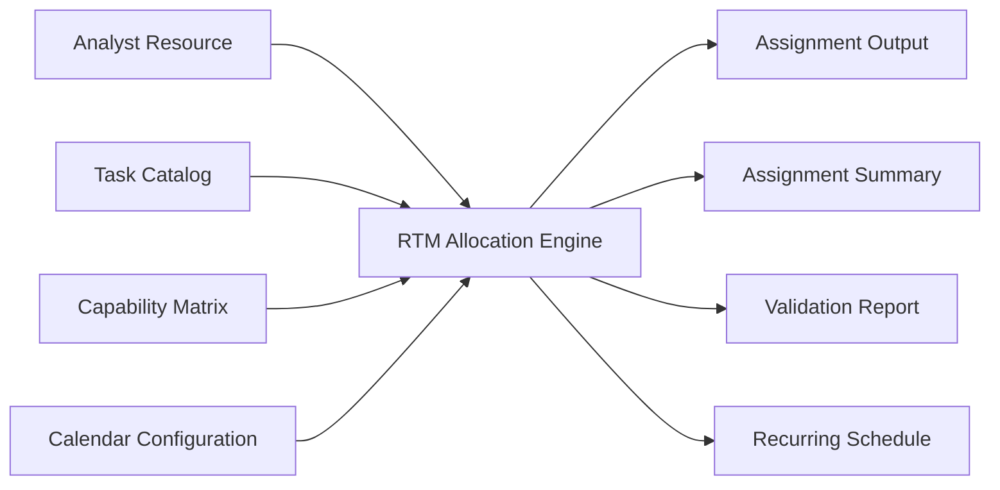

# Resource & Task Manager (RTM)

> **Status:** Production Prototype *(Sanitized Portfolio Version)*  
> **Role:** Solution Architect • Process Designer • Excel VBA Developer  
> **Technologies:** Excel VBA • Microsoft Excel • Rule-Based Optimization • Workflow Automation

A rule-based **workforce allocation engine** built in Excel VBA that automates monthly operational resource planning by matching qualified analysts to work based on capability, priority, capacity, and business constraints.

> **Portfolio Note:** All analyst names, task names, capability codes, thresholds, metrics, and business terminology have been generalized. This case study demonstrates the engineering approach while protecting confidential operational information.

---

# Executive Summary

The **Resource & Task Manager (RTM)** replaces a slow, manual, and error-prone monthly planning process with a deterministic allocation engine capable of producing consistent, auditable, and balanced workforce plans.

Rather than relying on manual judgement and spreadsheets, RTM evaluates analyst qualifications, task priorities, workload capacity, exposure limits, scheduling constraints, and operational business rules to automatically generate monthly allocations and recurring schedules.

Given the same inputs, the engine always produces the same output—making workforce planning transparent, repeatable, and easy to audit.

---

# Business Context

The solution was designed for an analyst-driven operational environment where hundreds of recurring tasks must be distributed across a team of specialists with different certifications, capabilities, and approval rights.

Every planning cycle must satisfy multiple operational constraints simultaneously, including:

- Capability certification
- Business priority
- Remaining analyst capacity
- Daily operational coverage
- Self-approval permissions
- Exposure balancing
- Manual planner overrides

Monthly planning is performed repeatedly and directly impacts operational stability, making consistency and auditability critical.

---

# Business Problem

The existing planning process suffered from several recurring operational challenges:

- **Inconsistent decisions** — allocation quality depended heavily on the individual planner.
- **Limited auditability** — explaining why a specific analyst received a specific task required manual investigation.
- **Hidden scheduling risks** — a plan could appear fully allocated while still violating daily operational coverage requirements.
- **High manual effort** — planners spent hours balancing workloads while validating business constraints.

The organization required a repeatable planning process capable of generating qualified, balanced, and fully explainable allocations without extensive manual intervention.

---

# Solution Overview

RTM approaches workforce planning as a **constraint-based optimization problem** rather than a simple assignment routine.

Instead of assigning tasks sequentially, every allocation considers multiple operational factors simultaneously, including:

- Analyst capability
- Task priority
- Remaining capacity
- Exposure reserves
- Scheduling constraints
- Planner overrides
- Self-approval rights

The result is an allocation engine that produces consistent decisions while remaining transparent and fully auditable.

---

# Solution Architecture



## Input Data

| Worksheet | Purpose |
|-----------|---------|
| `Analyst_Resource` | Analyst roster, available capacity, manual assignments, exclusions, exposure settings |
| `Task_List` | Task catalog, required capabilities, priorities, allocation rules |
| `Analyst_Capability_Matrix` | Certification matrix and approval permissions |
| `Calendar_Setup` | Working-day configuration used by the scheduling engine |

## Generated Outputs

| Worksheet | Purpose |
|-----------|---------|
| `Assignment_Output` | Detailed allocation results |
| `Assignment_Summary` | Aggregated allocation statistics |
| `Validation_Check` | Constraint violations and planning warnings |
| `Scheduler_Calendar` | Daily recurring assignment schedule |

---

# Key Features

- Capability-based task allocation
- Priority-aware workforce planning
- Round-robin workload balancing
- Configurable exposure reserve management
- Automatic self-approval workload adjustment
- Manual assignment lock support
- Calendar-based recurring scheduling
- Automated validation and audit reporting

---

# Technology Stack

| Technology | Purpose |
|------------|---------|
| Excel VBA | Allocation engine implementation |
| Microsoft Excel | Data model, configuration, and reporting |
| Mermaid | Architecture documentation |
| Rule-Based Optimization | Workforce allocation logic |

---

# Engineering Decisions

Several design decisions significantly improved both maintainability and allocation quality.

### Analyst-Centric Allocation

Instead of filling tasks one at a time, the engine prioritizes analyst utilization across all eligible work, resulting in a more balanced distribution.

---

### Order-Independent Lookups

Task relationships are resolved using names rather than worksheet positions, preventing failures caused by spreadsheet sorting.

---

### Multi-Pass Capacity Release

Exposure reserves are protected during the initial allocation and only released if additional capacity is required, improving workload balance.

---

### Deterministic Allocation

The engine intentionally minimizes randomness.

The only randomized component is analyst ordering within the same priority tier, ensuring that repeated executions with identical inputs produce consistent results.

---

# Business Impact

> **Note:** The figures below are representative placeholders.

## Operational Benefits

- Reduced monthly planning effort from several hours to a single macro execution
- Improved consistency across planning cycles
- Increased workload fairness across analysts
- Simplified operational planning
- Improved auditability and traceability

## Technical Benefits

- Deterministic allocation engine
- Rule-driven decision making
- Configurable business rules
- Automated validation framework
- Transparent scheduling logic

---

# Challenges & Lessons Learned

Several engineering discoveries fundamentally changed the design of the engine.

### Monthly Capacity Does Not Guarantee Daily Coverage

One of the biggest insights was recognizing that monthly allocation percentages can hide operational gaps at the daily level.

This shifted the scheduling model from purely capacity-based planning toward operational coverage validation.

---

### Business Rules Interact

Capability restrictions, specialization requirements, approval permissions, and scheduling constraints can combine to eliminate every eligible analyst for a task.

Explicit validation became essential.

---

### Spreadsheet Ordering Should Never Be Trusted

Early implementations relied on worksheet positions.

Moving to name-based lookups eliminated an entire class of difficult-to-debug issues.

---

### Preserve Working Logic

Rather than rewriting existing functionality, new features were added incrementally.

This approach improved stability, reduced regressions, and made the evolution of the engine easier to understand.

---

# Future Improvements

- Formalize non-deferrable daily coverage as Tier 0 constraints
- Capacity netting before allocation
- Full analyst daily schedule generation
- Automated operational escalation reporting

---

# My Role

I designed and developed the Resource & Task Manager from concept through implementation.

My responsibilities included:

- Requirements analysis
- Business rule design
- Solution architecture
- Excel VBA development
- Allocation algorithm design
- Validation framework
- Testing and debugging
- Documentation
- Continuous enhancement based on operational feedback

---

# Getting Started

1. Open the workbook and enable macros.
2. Populate the four input worksheets.
3. Execute:

```vba
Run_RTM_Assignment
```

4. Review the generated allocation reports and validation outputs.

---

# Configuration

| Parameter | Default | Description |
|-----------|---------|-------------|
| `CHUNK_SIZE` | `8` | Hours assigned per allocation cycle |
| Daily Analyst Cap | `2` | Maximum recurring hours per analyst per day |
| Daily Coverage Target | `32` | Required recurring coverage hours per working day |

---

# License

MIT License

---

> *This project demonstrates how operational knowledge, business rules, and software engineering can be combined to transform a manual planning process into a deterministic, scalable, and auditable workforce allocation system.*
